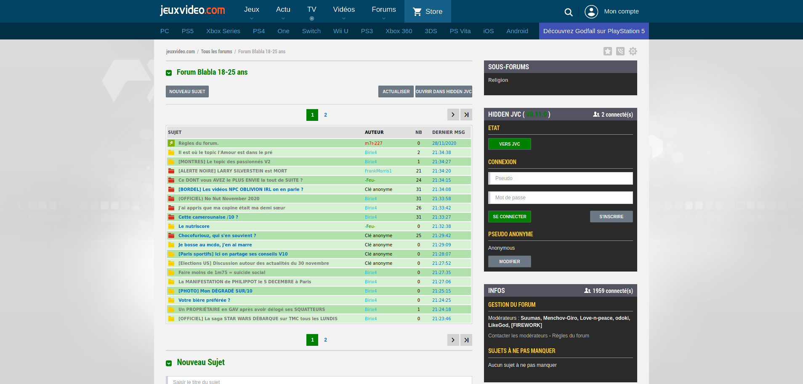
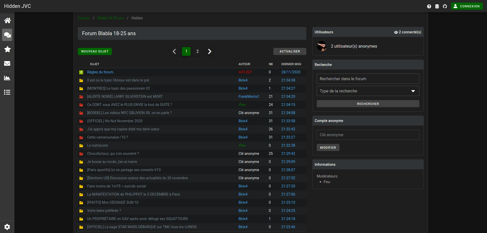

# Hidden JVC Extension

Hidden JVC est un forum intégré aux forums de https://www.jeuxvideo.com/.

Pour chaque forum JVC, il existe un forum Hidden JVC associé qui est hébergé sur un autre serveur afin d'éviter la modération abusive de webedia. 
Grâce à Hidden JVC vous pouvez poster des messages sur les topics de JVC et créer des topics complétement indépdendant. Tous ne sont visible que par les utilisateurs de l'extension JVC.

Ces forums parallèles sont accessibles de deux façons:

* Depuis une extension web qui permet d'intégrer directement les topics d'Hidden JVC sur l'interface de JVC.

* Depuis un site web qui permet de consulter Hidden JVC si jamais l'extension ne fonctionne plus suite à un blocage de webedia.

Le projet est actuellement en version Beta. De nouvelles fonctionnalités sont encore à venir.

Extension | Site Web
:-:|:-:
 | 

* [Installation](#Installation)
* [FAQ](#FAQ)

## Installation

### Firefox

Aller sur https://github.com/Hidden-JVC/hidden-jvc-extension/releases/tag/1.0.0

Cliquer sur le fichier `hidden-jvc-extension-[version].xpi`

### Chrome (maintenue par [@borrougagnou](https://github.com/borrougagnou))

https://chrome.google.com/webstore/detail/hidden-jvc/mdghlmpglafocnnpohgfeckaickmkapc

### Opera (maintenue par [@borrougagnou](https://github.com/borrougagnou))

https://addons.opera.com/fr/extensions/details/e5d1a89073216349f761e454b6209efd5d219e6e/

### Version web

https://web.hiddenjvc.com/#/forums/51/hidden

## FAQ

### Quelles différences avec JVP ? (https://wiki.jvflux.com/JV_Parallele)

La principal différence avec JVC est que Hidden JVC est open source et à plusieurs plateformes qui permettent de consulter les forums en cas de blocage de l'extension par JVC.

### Pourquoi une extension web plutôt qu'un userscript ?

Quand le propriétaire d'un site web est hostile à un userscript comme l'a été webedia avec JVP, ça devient très vite difficile voir impossible de pouvoir contrer les tentatives de bloquer le bon fonctionnement du userscript. Les extensions ayant plus de pouvoir que les userscript il est plus facile de luter contre ces attaques, notamment sur Firefox.

<!-- ## Fonctionnalités

* Pouvoir poster des messages sur des topics JVC visible uniquement pour les utilisateurs d'Hidden JVC.

* Pouvoir poster sur des topics lock de JVC.

* Pouvoir créer des topics sur les serveurs d'Hidden JVC mais néanmoins toujours consultable depuis JVC.

* Pouvoir poster avec ou sans compte

* Mode fic pour ne voir que les posts de l'auteur d'un topic.

* Toutes les actions de modérations sont consultables en temps réel.

* Les dernières sauvegardes de la base de données sont téléchargeables.

* Backup accessible depuis https://hiddenjvc.com/database-backups/ -->
