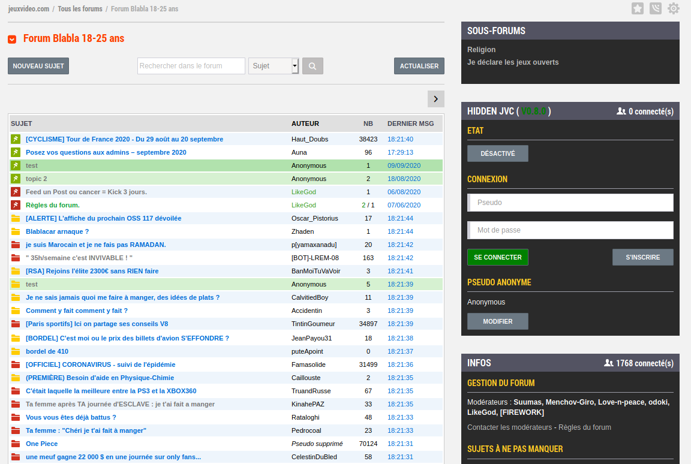

# Guide utilisateur

## Menu

Le menu d'Hidden JVC se situe sur toutes les pages sur le coté droit de la page.
Le bouton sous le menu "Etat" permet de savoir si l'on se trouve sur le jvc classique (Désactivé) ou sur hidden jvc (Activé).

Sur hidden JVC, il est possible de poster anonyment sans créer de compte. Pour cela il faut ne pas être connecté avec un compte Hidden JVC et deux menus sont présent.

Le menu "Connexion" qui permet à la fois de se connecter ou de créer un nouveau compte.
Le menu "Pseudo anonyme" qui permet de choisir n'importe quel pseudo pour poster anonymement.

Si vous êtes connecté alors vous aurez simplement un menu vous permettant de vous deconnecter.

## Liste des sujets

Sur cette liste, on peut voir les sujets cachés dont le dernier post se situe entre le premier et le dernier post de la liste des sujets de jvc. Les sujets caché apparaiterons avec un fond vert.

Si un topic jvc contient au moins un post d'Hidden JVC alors sont titre sera en vert et le nombre de post cachés sera affiché dans la colonne "NB"

## Topic JVC

Les messages d'Hidden JVC sont intégrés entre les messages de JVC trier par date.
Un trait vert sera rajouté sur le numéro d'une page dans la pagination ce qui signifie qu'au moins un message d'Hidden JVC se trouve sur cette page.

A noter qu'il est également possible de poster des messages cachés sur les topics lock de JVC.

## Liste des sujets cachés

## Topic caché