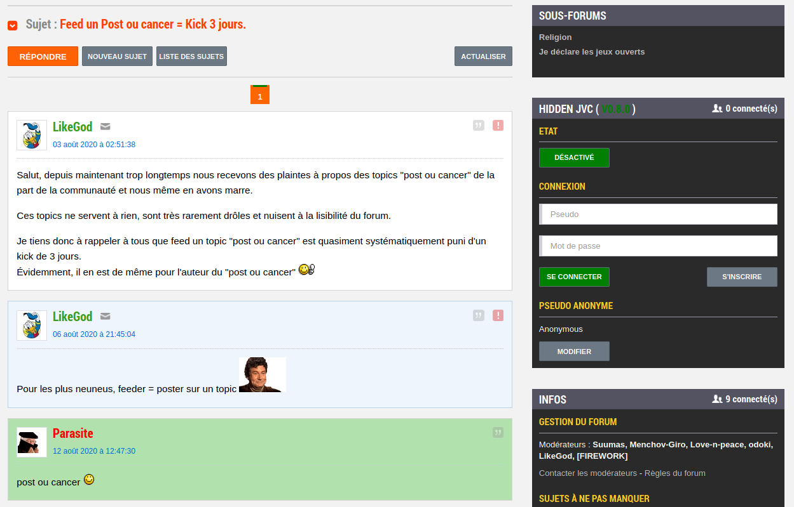

# Guide utilisateur

## Menu

Le menu d'Hidden JVC se situe sur toutes les pages sur le coté droit de la page.

Quand vous êtes sur la liste des sujet, la partie "ETAT" apparait et permet de passer entre JVC et Hidden JVC

La partie "Connexion" permet à la fois de se créer un compte et de se connnecter. A noter qu'on peut poster sur Hidden JVC sans compte.

La partie "Pseudo anonyme" permet de choisir le pseudo avec lequel vous allez poster si vous n'êtes pas connecté.

## Liste des sujets JVC

Sur la liste des sujets classique de JVC les topics d'Hidden JVC sont sur un fond vert.

Les topics JVC avec au moins un post d'Hidden JVC ont un titre vert et le nombre de posts est ajouter dans la colonne "NB"

## Topic JVC

Sur un topic JVC classique les posts d'Hidden JVC apparaissent sur un fond vert.

Il y a également un trait vert sur les pages qui contiennent un post. (Cet indicateur peut être incorrect si des posts JVC sont supprimés).

A noter qu'il est possible de poster sur les topics lock de JVC.

## Liste des sujets Hidden JVC

Quand vous êtes sur cette page tout les topics JVC sont remplacés par ceux de Hidden JVC

## Topic d'Hidden JVC

Sur les topics d'Hidden JVC vous pouvez cliquer sur le bouton "Mode fic" pour n'afficher que les posts de l'auteur du topic.

